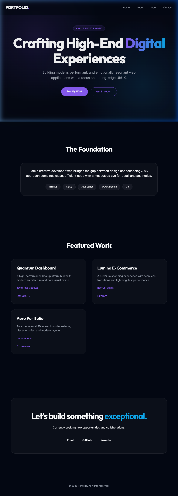

# Creative Portfolio | Digital Experiences

A modern, high-end personal portfolio website designed with a focus on cutting-edge UI/UX, featuring glassmorphism, smooth animations, and a responsive layout.



## 🚀 Features

-   **Premium Aesthetics**: Modern design using glassmorphism and deep gradient backgrounds.
-   **Dynamic UI**: Animated mesh gradients and hover effects for an interactive experience.
-   **Fully Responsive**: Optimized for all device sizes from mobile to desktop.
-   **Project Showcase**: A structured grid to highlight featured work with tech tags.
-   **Optimized Performance**: Built with clean, semantic HTML and vanilla CSS for lightning-fast load times.

## 🛠️ Tech Stack

-   **Core**: [HTML5](https://developer.mozilla.org/en-US/docs/Web/HTML)
-   **Styling**: [Vanilla CSS3](https://developer.mozilla.org/en-US/docs/Web/CSS)
-   **Typography**: [Google Fonts](https://fonts.google.com/) (Inter & Outfit)
-   **Icons/Assets**: Custom CSS shapes and mesh gradients.

## 📂 Project Structure

```text
├── index.html      # Main structural file
├── style.css       # Core design and styling
├── hero-bg.png     # Hero section background asset
└── screenshot.png  # Project preview for README
```

## 💻 Getting Started

To view this portfolio locally:

1.  Clone the repository:
    ```bash
    git clone https://github.com/NityaRI/portfolio.git
    ```
2.  Navigate to the project directory:
    ```bash
    cd portfolio
    ```
3.  Open `index.html` in your preferred browser.

## 📮 Contact

Feel free to reach out for collaborations or inquiries:
-   **Email**: hello@example.com
-   **LinkedIn**: [Your Profile](#)
-   **GitHub**: [Your GitHub](#)

---
*Created with ❤️ by NityaRI*
